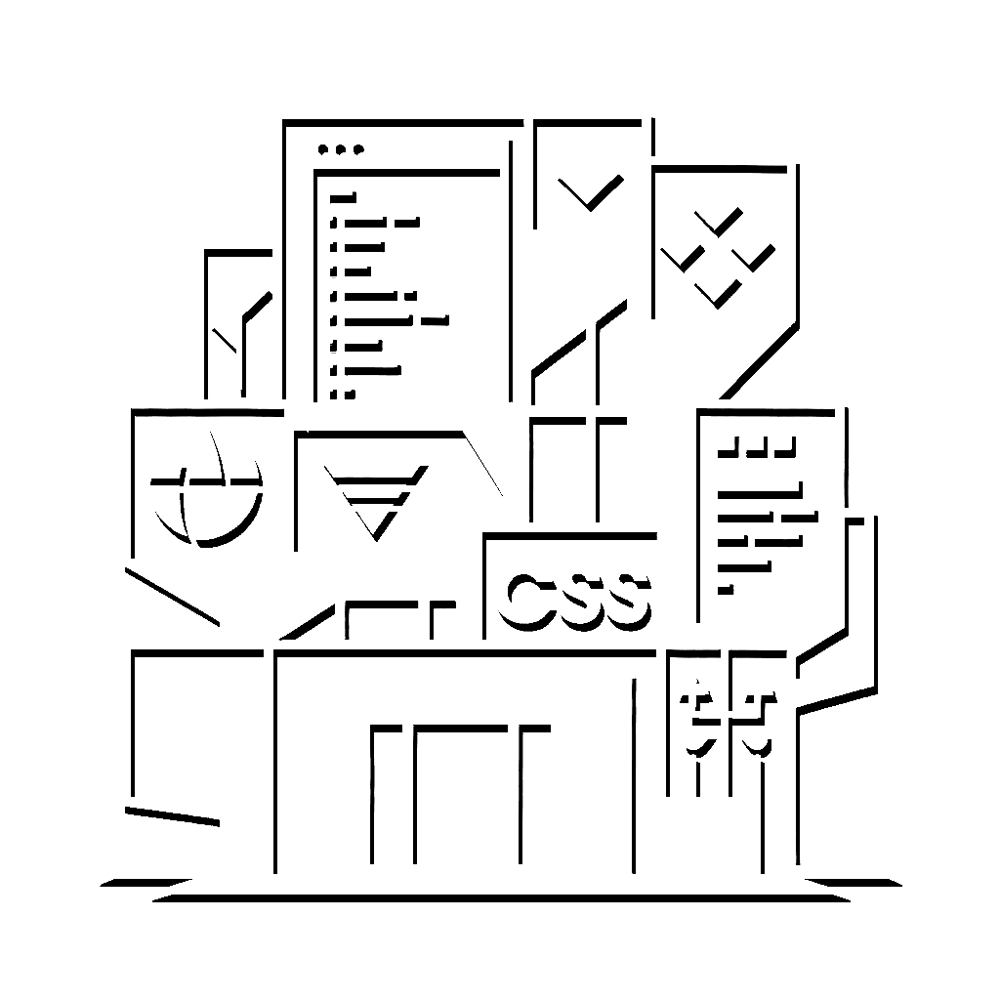
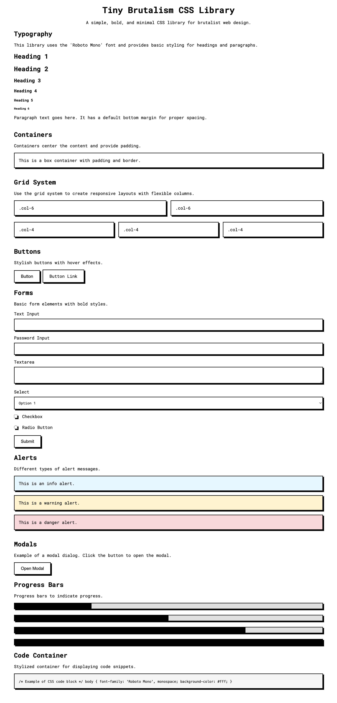

<div align="center">
  <a href="https://pruger.github.io/tiny-brutalism-css/" target="_blank"></a>
  <h2>Tiny Brutalism CSS</h2>

  <a href="https://x.com/nop_sl3d">Twitter</a> / <a href="https://github.com/pruger/">Github</a>
</div>

Tiny BRUTALISM CSS: ***Tiny, brutalism style***  CSS framework


# About
Tiny Brutalism is a minimalist, brutalist-style CSS framework that focuses on monochrome colors, hard edges, and prominent drop shadows. It is designed to be simple, small, and easy to use.

### Features
* Tiny . < 4KB (3884)
* Brutal

### Installation
Local installation only at this time. CDN Delivery shortly
````
    <link rel="stylesheet" href="tiny-brutalism.css">
````

### Usage
Tiny Brutalism provides components with predefined styles. You will need to define your own layout. 

### Demo
**[Documentation / Demo](https://pruger.github.io/tiny-brutalism-css)**

### Sample Applications
Collection of small mockup apps to show the simplicity and ease of use of the library
This will be updated frequently.


[Sample Apps](sample_apps/)

### Preview


